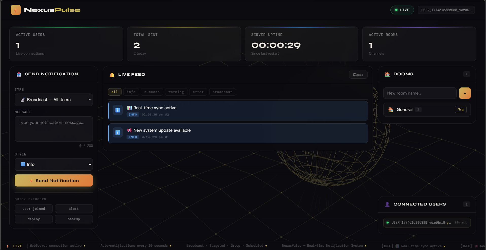
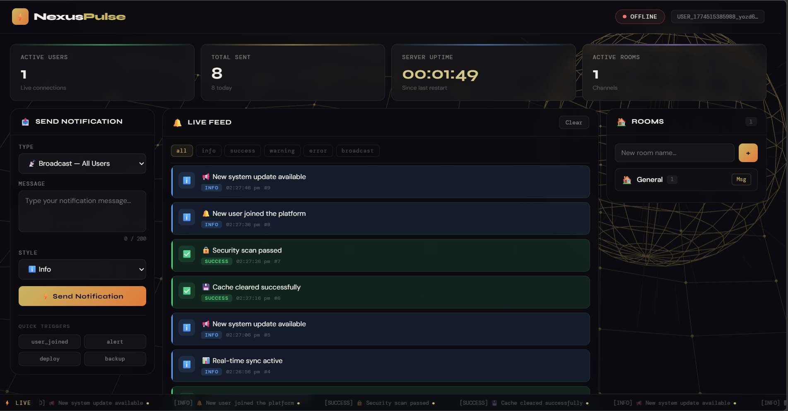

# ⚡ NexusPulse — Real-Time Notification System
 Active WebSocket connection — Client successfully connected to the backend server
 Connection failure state — Client running but unable to establish connection with backend server
[](https://nodejs.org/)
[](https://socket.io/)
[](https://reactjs.org/)
[](LICENSE)

> A production-grade real-time notification system built with Node.js + Socket.IO and React. Supports broadcast, targeted, group (room-based), scheduled, and event-triggered notifications — with live connection tracking, auto-reconnection, and a fully interactive dashboard.

---

## 📋 Table of Contents

- [Quick Start](#-quick-start)
- [Method Choice: WebSockets vs SSE](#-method-choice-websockets-vs-sse)
- [How Real-Time Communication Works](#-how-real-time-communication-works)
- [Project Structure](#-project-structure)
- [Features](#-features)
- [API Reference](#-api-reference)
- [WebSocket Events](#-websocket-events)
- [Environment Variables](#-environment-variables)
- [Potential Improvements](#-potential-improvements)

---

## 🚀 Quick Start

### Prerequisites
- Node.js v18 or higher
- npm v6 or higher

### 1. Clone the Repository

```bash
git clone https://github.com/Sanskar225/notification_dashboard-
cd notification_dashboard-
```

### 2. Start the Backend

```bash
cd backend
npm install
cp .env.example .env      # copy environment config (edit if needed)
npm run dev               # development mode with auto-reload
# or
npm start                 # production mode
```

The backend server starts at **http://localhost:3000**

> **Default config** — the server works out of the box with no `.env` changes. Auto-notifications fire every 10 seconds and WebSocket connections are accepted from any origin.

### 3. Start the Frontend (Development Mode)

```bash
cd frontend
npm install
npm run dev
```

The frontend dev server starts at **http://localhost:5173** and automatically proxies `/api`, `/health`, and `/socket.io` requests to the backend.

### 4. Build Frontend for Production (Optional)

```bash
cd frontend
npm run build
```

This outputs built files to `../client/`, which the backend serves via `express.static`. After building, the entire app is available at **http://localhost:3000** — no separate frontend server needed.

---

## 🔌 Method Choice: WebSockets vs SSE

**This project uses WebSockets via Socket.IO.**

| Feature | WebSockets (chosen) | Server-Sent Events |
|---|---|---|
| Communication | Bidirectional | Server → Client only |
| Protocol | `ws://` / `wss://` | HTTP |
| Reconnection | Built-in (Socket.IO) | Manual implementation |
| Room/Group support | Native | Not supported |
| Fallback transport | HTTP long-polling | None |
| Binary support | Yes | Text only |

**Why WebSockets?**

The core reason is **bidirectionality**. In this system, clients don't just receive notifications — they also send them. A user can broadcast a message to all clients, target a specific user by ID, send to a room, or schedule a delayed notification. All of this requires data flowing from client to server, which SSE cannot do.

Additionally, Socket.IO's room-based pub/sub makes group notifications trivial — `io.to(roomId).emit(...)` delivers a message only to members of that room. Replicating this with SSE would require maintaining per-room subscription lists manually and polling or long-polling to receive client input, which negates SSE's simplicity advantage.

Socket.IO also adds automatic reconnection with exponential backoff, heartbeat/ping-pong to detect stale connections, and transparent fallback to HTTP long-polling when WebSocket is blocked by a corporate proxy — all of which matter in a production system.

---

## 📡 How Real-Time Communication Works

### Connection Lifecycle

When a client loads the page:

```
1. Socket.IO performs WebSocket handshake (upgrades from HTTP)
2. Server generates a unique USER_id (e.g. USER_1703001234567_ab3f9c2d)
3. Client is automatically added to the "general" room
4. Server emits `welcome` → client stores its userId and active count
5. Server broadcasts `clients-update` → all clients refresh their user list
```

### Notification Delivery Methods

```
Auto (every 10s):   Server ──► io.emit('notification')            ──► ALL clients
Broadcast:          Client ──► 'send-broadcast'  ──► Server ──► ALL clients
Targeted:           Client ──► 'send-targeted'   ──► Server ──► ONE client (by userId)
Group:              Client ──► 'send-to-group'   ──► Server ──► ROOM members only
Scheduled:          Client ──► 'schedule-notification' ──► Server setTimeout ──► broadcast
Event trigger:      Client ──► 'trigger-event'   ──► Server ──► ALL clients
```

### Connection Tracking

The server maintains two Maps in `ConnectionManager`:

```js
this.clients  = new Map()   // socketId  → full client object
this.userIdMap = new Map()  // userId    → socketId
```

On every connect/disconnect, the server broadcasts `clients-update` with the current count and client list. The frontend `useSocket` hook listens to this event and updates `activeClients` state in real time — no polling required.

Stats tracked:
- Current active connections
- Peak connections (historical high)
- Total connections since server start
- Per-client: connected timestamp, last ping, IP, joined rooms

### Disconnect & Reconnection Handling

```
Client disconnects
  └─► 'disconnect' event fires on server
  └─► ConnectionManager removes client from Map
  └─► RoomManager removes client from all rooms it joined
  └─► io.emit('clients-update') fires → all clients update their count
  └─► If a non-default room becomes empty → room is deleted automatically

Client reconnects (Socket.IO handles this automatically)
  └─► New socket created, new USER_id assigned
  └─► Client re-joins 'general' room
  └─► `welcome` event re-emitted with new userId
  └─► Frontend shows "Reconnected" toast
```

Idle connections (no ping for 5+ minutes) are cleaned up by a background task in `ConnectionManager.cleanupIdleConnections()`.

### Auto-Notification Scheduler

Every 10 seconds (configurable via `AUTO_NOTIFICATION_INTERVAL`):

```js
setInterval(() => {
  if (activeClients > 0) {
    const notification = generateRandomNotification() // weighted random from pool
    io.emit('notification', notification)             // broadcast to all
  }
}, interval)
```

The message pool uses weighted random selection — success messages appear more often than warning messages, matching real-world notification patterns.

---

## 📁 Project Structure

```
project-root/
├── backend/
│   ├── src/
│   │   ├── index.js              # Entry point, process error handlers, graceful shutdown
│   │   ├── server.js             # Express + Socket.IO setup, middleware, static serving
│   │   ├── socket.js             # All Socket.IO event handlers
│   │   ├── connectionManager.js  # Tracks active clients, stats, idle cleanup
│   │   ├── notificationService.js# Creates, sends, schedules notifications; history
│   │   ├── roomManager.js        # Room CRUD, membership, default "general" room
│   │   ├── routes.js             # REST API endpoints
│   │   ├── logger.js             # Colored console + file logging
│   │   └── utils.js              # sanitizeMessage, truncateMessage, isValidMessage
│   ├── .env.example
│   └── package.json
│
└── frontend/
    ├── src/
    │   ├── App.jsx               # Root layout, grid, stat cards
    │   ├── hooks/
    │   │   ├── useSocket.js      # All Socket.IO logic and state management
    │   │   └── useStats.js       # Polls /api/stats/detailed every 15s
    │   ├── components/
    │   │   ├── Header.jsx        # Connection badge, userId copy button
    │   │   ├── StatCard.jsx      # Live stat cards with flash animation
    │   │   ├── SendPanel.jsx     # Dynamic form for all 5 notification types
    │   │   ├── NotificationFeed.jsx # Filtered scrolling notification history
    │   │   ├── RoomsPanel.jsx    # Create/join/leave rooms, send group messages
    │   │   ├── ClientsPanel.jsx  # Live list of connected users
    │   │   ├── ToastContainer.jsx# Stacked toast notifications with timer bar
    │   │   ├── TickerBar.jsx     # Bottom scrolling ticker (latest events)
    │   │   ├── VantaBackground.jsx # Interactive Vanta.js globe background
    │   │   └── Panel.jsx         # Reusable panel wrapper
    │   ├── utils.js              # TYPE_ICONS, TYPE_COLORS, timeAgo, escHtml
    │   └── styles/globals.css    # CSS variables, animations, scrollbar, type classes
    ├── vite.config.js            # Dev proxy config, production build output
    └── package.json
```

---

## ✨ Features

### Notification Types

| Type | Description | Socket Event |
|---|---|---|
| 📢 Broadcast | Sent to all connected clients | `send-broadcast` |
| 🎯 Targeted | Sent to one specific user by ID | `send-targeted` |
| 👥 Group | Sent to all members of a room | `send-to-group` |
| ⏰ Scheduled | Delivered after a configurable delay | `schedule-notification` |
| ⚡ Event Trigger | Named event broadcast (deploy, alert, etc.) | `trigger-event` |

### Notification Styles

Each notification carries a `type` field that controls its visual styling:

| Style | Color | Use Case |
|---|---|---|
| `info` | Blue | General updates |
| `success` | Green | Completions, confirmations |
| `warning` | Yellow | Alerts requiring attention |
| `error` | Red | Failures, critical issues |

### Dashboard

- **Live Stats** — Active users, total notifications sent, server uptime (live counter), active rooms
- **Notification Feed** — Scrollable history of last 100 notifications with type-based filter tabs
- **Connected Users** — Real-time list of all connected clients with connection timestamps
- **Rooms Panel** — Create rooms, join/leave, send group messages, see live member counts
- **Toast Notifications** — Stacked toasts with timer bar and per-type color coding
- **Ticker Bar** — Bottom scrolling ticker showing latest events in real time

### Input Safety

All user-supplied input passes through `utils.js` before reaching the broadcast layer:

- `sanitizeMessage()` — strips `<` and `>` characters (XSS prevention)
- `truncateMessage()` — enforces 200-character hard limit
- `isValidMessage()` — rejects empty or non-string payloads

---

## 📡 API Reference

All endpoints are prefixed with `/api`.

### Notification Endpoints

| Method | Path | Body | Description |
|---|---|---|---|
| `POST` | `/api/notify/broadcast` | `{ message, type }` | Send to all connected clients |
| `POST` | `/api/notify/target` | `{ userId, message, type }` | Send to one specific user |
| `POST` | `/api/notify/group` | `{ roomId, message, type }` | Send to all members of a room |
| `POST` | `/api/notify/schedule` | `{ delay, message, type, targetType, targetId }` | Schedule a delayed notification |
| `POST` | `/api/trigger` | `{ event, message }` | Trigger a named event broadcast |

### Monitoring Endpoints

| Method | Path | Description |
|---|---|---|
| `GET` | `/health` | Server health, uptime, active clients |
| `GET` | `/api/dashboard` | Combined connections + notifications + rooms snapshot |
| `GET` | `/api/stats/detailed` | Full stats with system info (memory, PID, Node version) |
| `GET` | `/api/clients` | List of active clients with metadata |
| `GET` | `/api/notifications/history` | Last N notifications (default 50, `?limit=N`) |

### Room Endpoints

| Method | Path | Body | Description |
|---|---|---|---|
| `GET` | `/api/rooms` | — | List all rooms with member counts |
| `POST` | `/api/rooms` | `{ name, creatorId }` | Create a new room |
| `GET` | `/api/rooms/:roomId` | — | Room details and current member list |

---

## 🔌 WebSocket Events

### Server → Client

| Event | Payload | Description |
|---|---|---|
| `welcome` | `{ userId, activeClients, serverTime, defaultRoom }` | Sent on first connect |
| `notification` | `{ id, message, type, timestamp, metadata }` | A notification to display |
| `clients-update` | `{ count, clients, timestamp }` | Fires on any connect/disconnect |
| `rooms-list` | `{ rooms[] }` | Current room list with member counts |
| `room-joined` | `{ roomId, roomName, members }` | Confirms successful room join |
| `room-left` | `{ roomId }` | Confirms room leave |
| `room-created` | `{ roomId, roomName }` | Confirms room creation |
| `room-users-update` | `{ roomId, count, users[], action, user }` | Room membership changed |
| `notification-sent` | `{ success, type, recipients }` | Confirms a send action |
| `notification-scheduled` | `{ success, jobId, deliveryTime }` | Confirms scheduling |
| `event-triggered` | `{ success, event }` | Confirms event trigger |
| `pong` | `{ timestamp }` | Heartbeat response |
| `error` | `{ message }` | Server-side validation error |

### Client → Server

| Event | Payload | Description |
|---|---|---|
| `send-broadcast` | `{ message, type }` | Broadcast to all clients |
| `send-targeted` | `{ targetUserId, message, type }` | Send to one user |
| `send-to-group` | `{ roomId, message, type }` | Send to room members |
| `schedule-notification` | `{ delay, message, type, targetType, targetId }` | Schedule delivery |
| `trigger-event` | `{ eventName, message }` | Fire a named event |
| `join-room` | `roomId` | Join a room |
| `leave-room` | `roomId` | Leave a room (cannot leave "general") |
| `create-room` | `roomName` | Create and join a new room |
| `get-rooms` | — | Request current room list |
| `ping` | — | Keepalive heartbeat (sent every 25s) |

---

## ⚙️ Environment Variables

Create `backend/.env` by copying `.env.example`:

```bash
cp backend/.env.example backend/.env
```

| Variable | Default | Description |
|---|---|---|
| `PORT` | `3000` | HTTP server port |
| `HOST` | `0.0.0.0` | Bind address |
| `NODE_ENV` | `development` | `development` or `production` |
| `CORS_ORIGIN` | `*` | Allowed CORS origin(s) |
| `AUTO_NOTIFICATION_INTERVAL` | `10000` | Auto-broadcast interval in ms |
| `ENABLE_AUTO_NOTIFICATIONS` | `true` | Set `false` to disable auto-scheduler |
| `PING_INTERVAL` | `25000` | Socket.IO ping interval in ms |
| `PING_TIMEOUT` | `60000` | Socket.IO ping timeout in ms |

---

## 🔧 Potential Improvements

With additional time, the following improvements would move this system toward full production readiness:

**Authentication & Identity**
Integrate JWT tokens so users maintain a persistent identity across reconnections. Currently each reconnect generates a new `USER_id`, which breaks targeted notification history.

**Notification Persistence**
Store notifications in MongoDB or Redis so history survives server restarts. The current in-memory store (last 100 notifications) is lost on restart.

**Read Receipts**
Track which users have received and seen which notifications using a per-notification delivery log, enabling sender confirmation and unread badges.

**Rate Limiting**
Add per-socket throttling (e.g. max 10 messages per 10 seconds) to prevent a single client from flooding the notification stream.

**End-to-End Encryption**
For targeted (private) messages, encrypt the payload before sending and decrypt on the recipient's client — preventing the server from reading private message content.

**Notification Preferences**
Allow users to opt in or out of specific notification types, stored in a user profile. The server would filter delivery based on each recipient's preferences.

**Analytics Dashboard**
Add a separate admin view with time-series charts (using Recharts or D3) showing notification volume, active users over time, and peak connection periods.

**Horizontal Scaling**
Replace the in-memory `ConnectionManager` with a Redis-backed adapter (`socket.io-redis`) so multiple Node.js processes can share connection state — enabling load balancing and zero-downtime deploys.

**Mobile Push Notifications**
Integrate Firebase Cloud Messaging (FCM) to deliver notifications to users who are offline, closing the gap between WebSocket delivery (online only) and true push delivery.

**TypeScript Migration**
Add full type safety across both frontend and backend for better IDE support, refactoring confidence, and self-documenting interfaces.

---

## 🏗️ Architecture Overview

```
┌─────────────────────────────────────────────────────────────────┐
│                        React Frontend                           │
│   useSocket.js ──────────────────────────────────────────────   │
│   (Socket.IO client, all state, event listeners)                │
│                                                                  │
│   SendPanel  NotificationFeed  RoomsPanel  ClientsPanel         │
└──────────────────────────┬──────────────────────────────────────┘
                           │  WebSocket  ws://localhost:3000
                           ▼
┌─────────────────────────────────────────────────────────────────┐
│                     Socket.IO Server                            │
│   socket.js  ───────  routes all events                         │
├────────────────┬──────────────────┬────────────────────────────┤
│ ConnectionMgr  │ NotificationSvc  │ RoomManager                 │
│ Map<socketId,  │ Broadcast, send, │ Rooms, members,             │
│ client>        │ schedule, history│ default "general" room      │
├────────────────┴──────────────────┴────────────────────────────┤
│                     Express REST API                            │
│  /api/notify/*  /api/rooms  /api/stats  /health                 │
└─────────────────────────────────────────────────────────────────┘
```

---

## 📄 License
This project is open source and available under the MIT License.

Contact## 📬 Contact

- 📧 Email: [sanskarsinha225@example.com](mailto:sanskarsinha225@example.com)
- 💼 LinkedIn: [linkedin.com/in/sanskar-sinha-185a36326](https://linkedin.com/in/sanskar-sinha-185a36326)
- 💻 GitHub: [github.com/Sanskar225](https://github.com/Sanskar225)
- 📸 Instagram: [@__sanskar225](https://instagram.com/__sanskar225)

Made with dedication by Sanskar Sinha